# Mermaid Diagrams for HopeOn Platform

This file contains all the Mermaid diagram codes for the HopeOn crowdfunding platform. You can copy these codes and paste them into:
- GitHub Markdown files
- Mermaid Live Editor (https://mermaid.live/)
- VS Code with Mermaid extension
- Any documentation tool that supports Mermaid

---

## 1. Authentication & User Management

### 1.1 Use Case Diagram

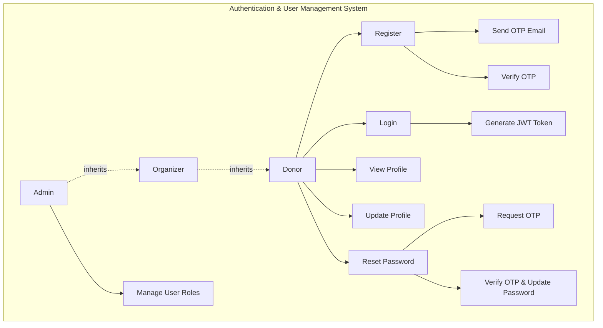

### 1.2 Activity Diagram - User Registration

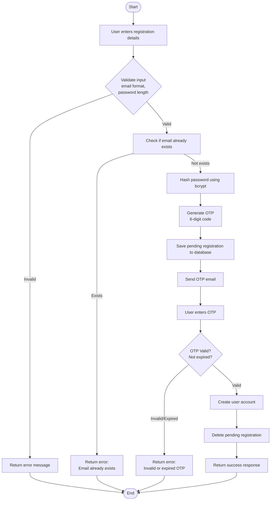

### 1.3 Sequence Diagram - Login Process

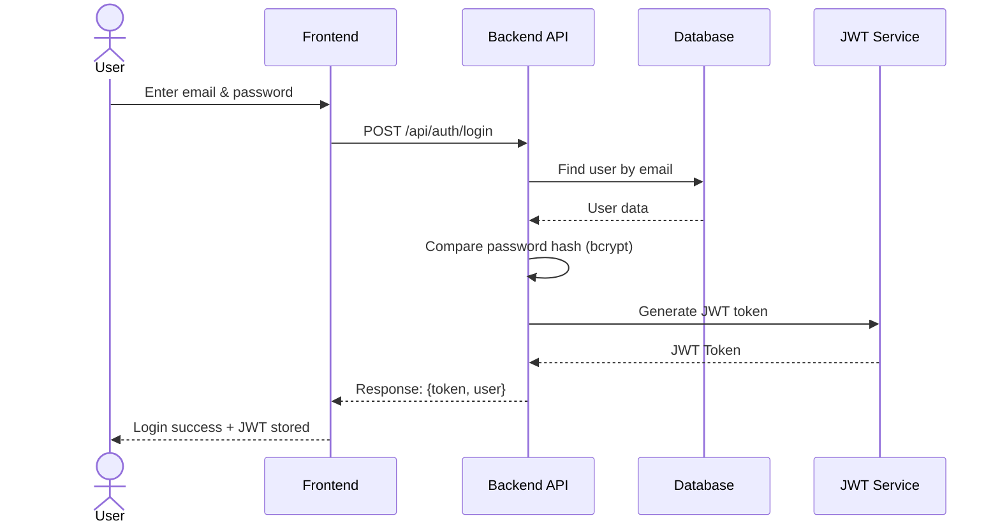

### 1.4 Entity Relationship Diagram - User

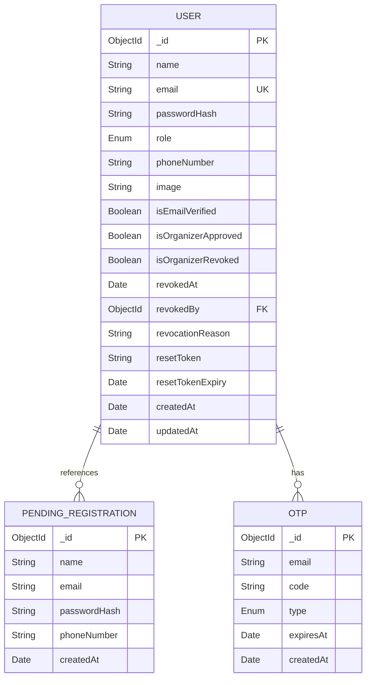

### 1.5 Class Diagram - Authentication Module

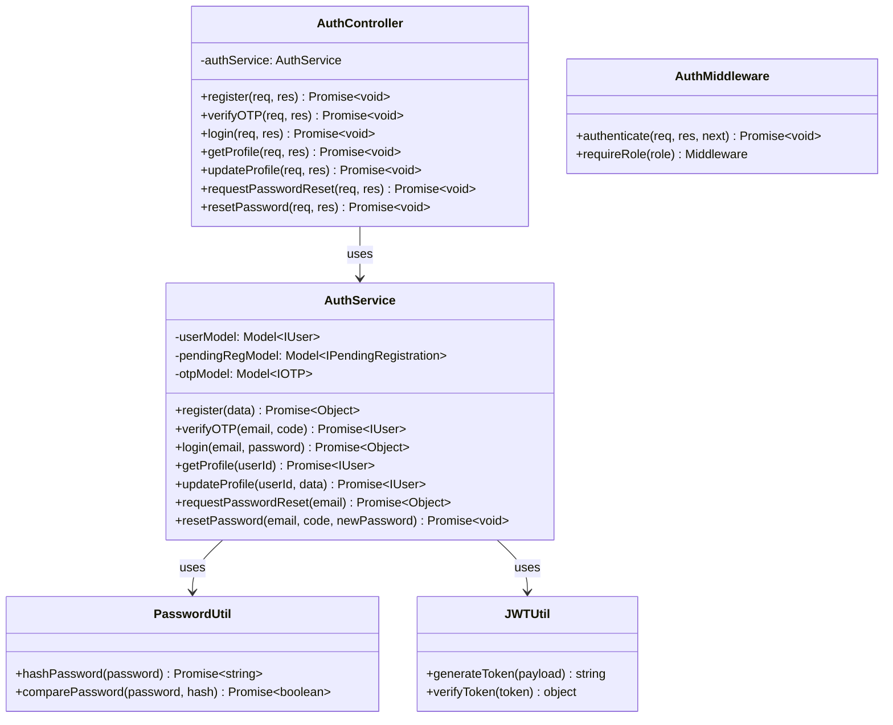

---

## 2. Campaign Management

### 2.1 Use Case Diagram

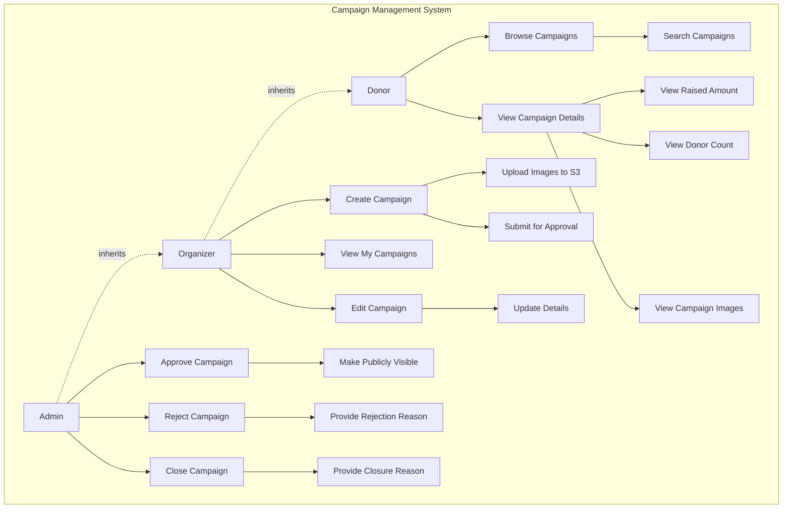

### 2.2 Activity Diagram - Campaign Creation

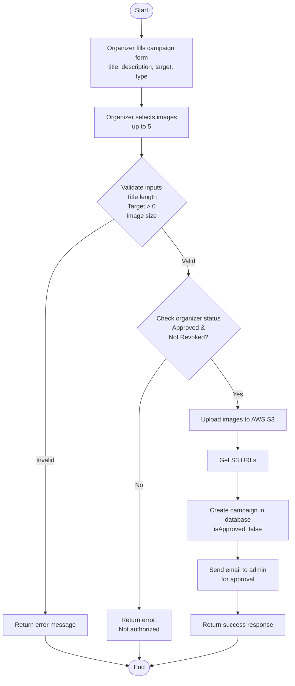

### 2.3 Sequence Diagram - Campaign Approval

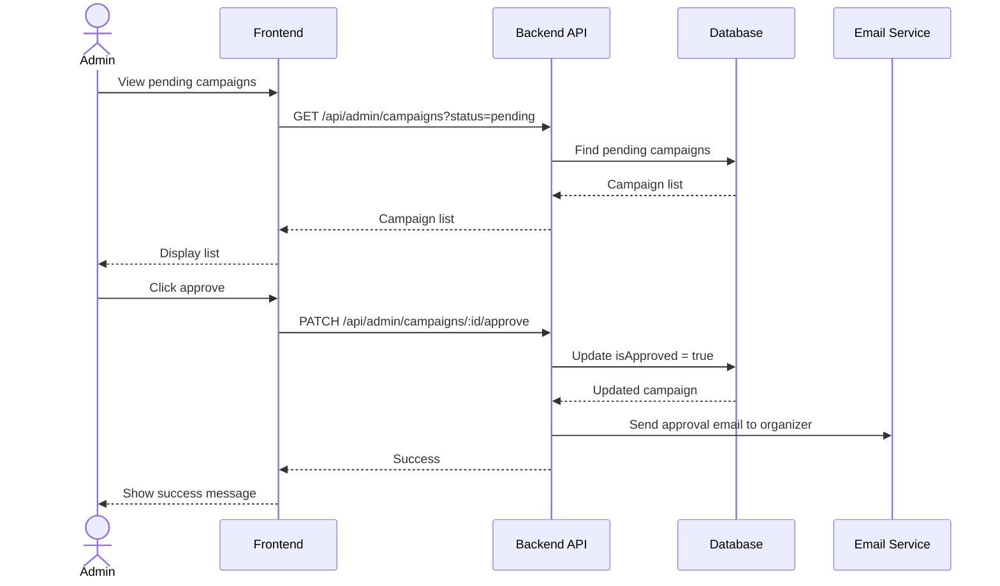

### 2.4 Entity Relationship Diagram - Campaign

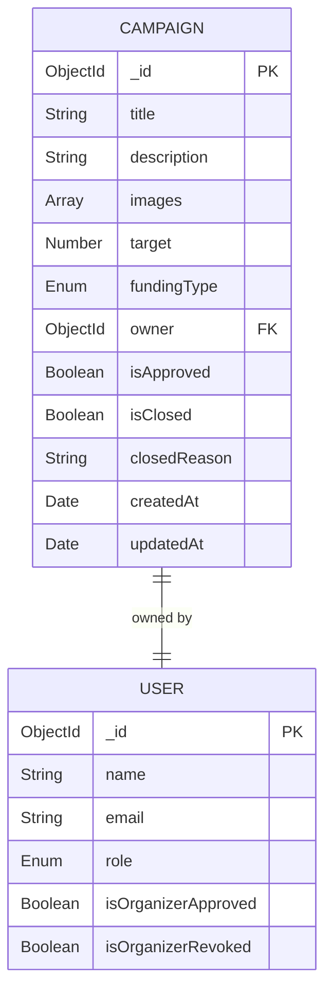

---

## 3. Payment Processing & Donation Management

### 3.1 Use Case Diagram

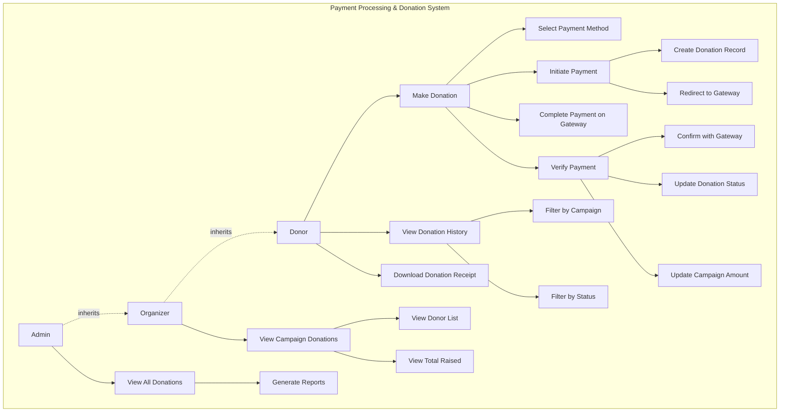

### 3.2 Activity Diagram - Payment Flow

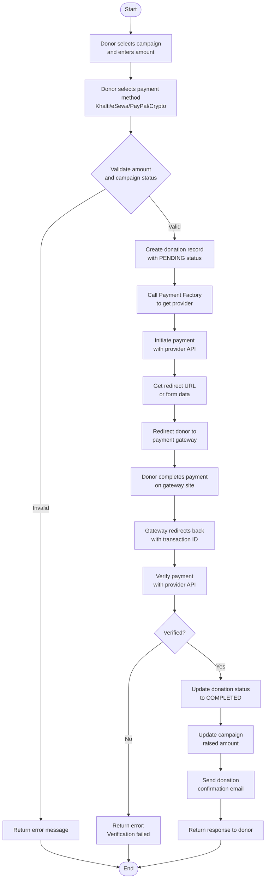

### 3.3 Sequence Diagram - Multi-Gateway Payment

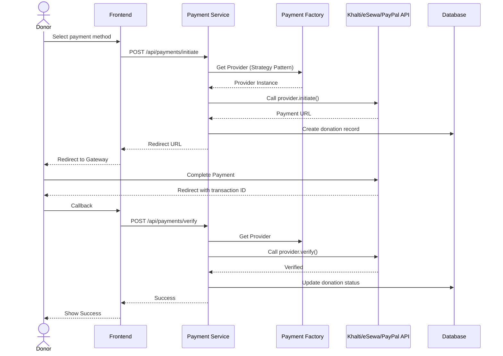

### 3.4 Class Diagram - Payment Architecture

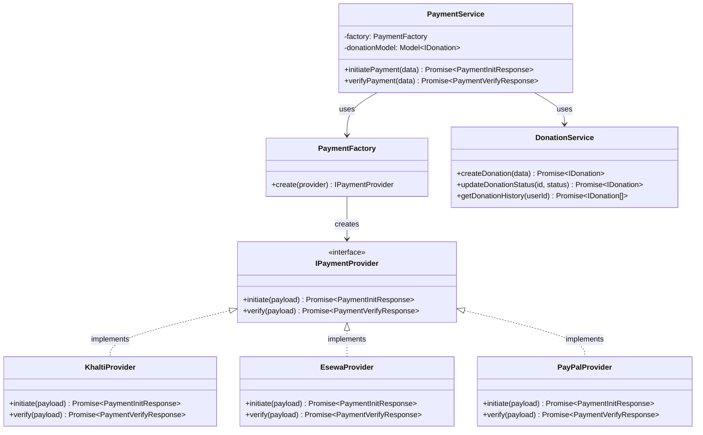

### 3.5 Entity Relationship Diagram - Donation

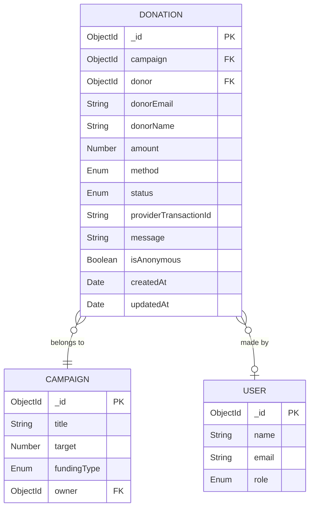

---

## 4. Organizer Application & Verification

### 4.1 Use Case Diagram

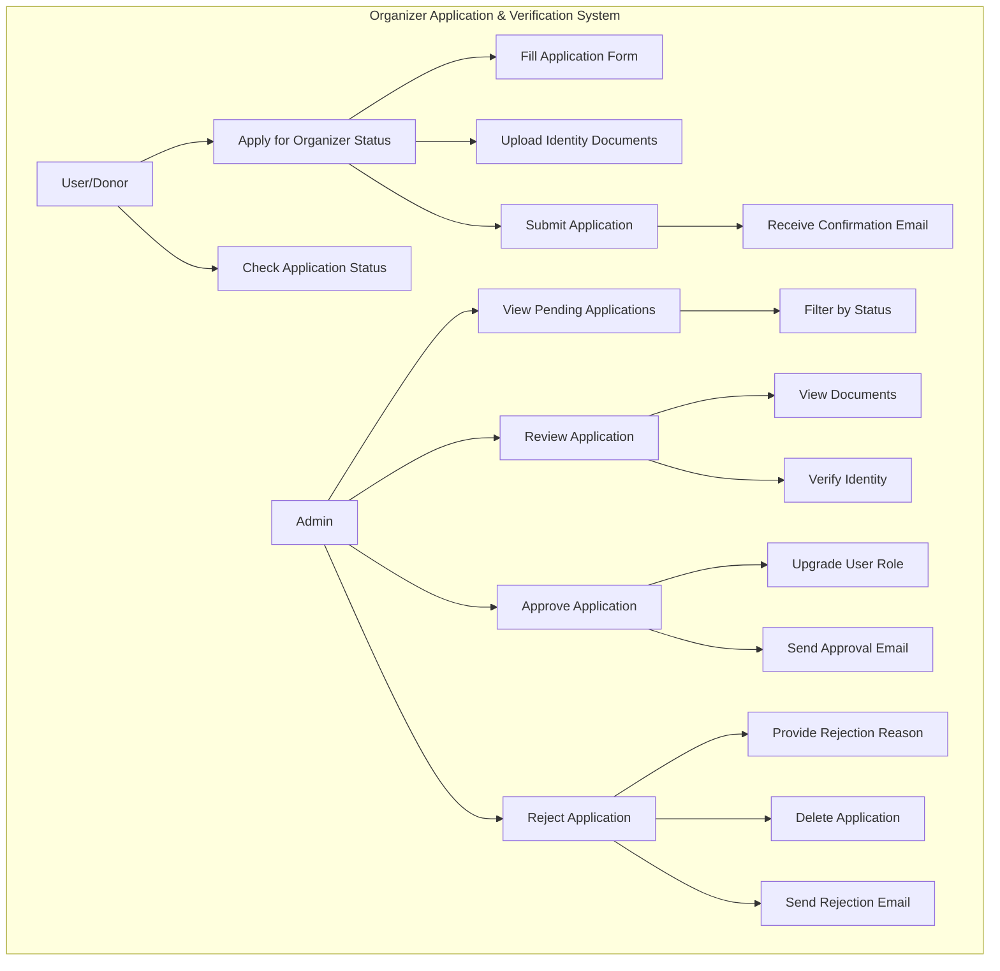

### 4.2 Activity Diagram - Application Review

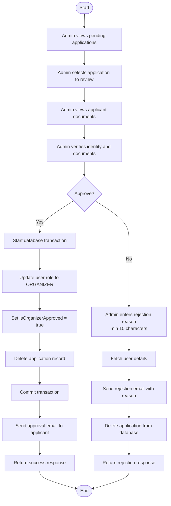

### 4.3 Sequence Diagram - Application Submission

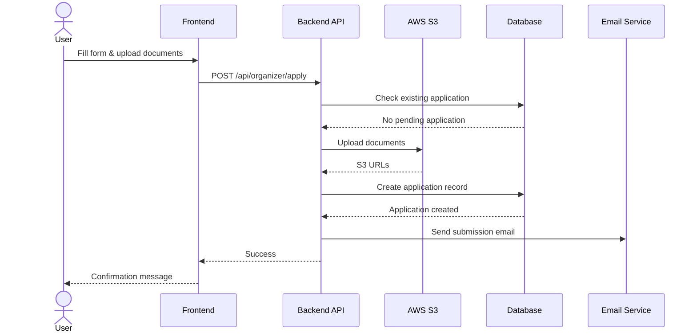

### 4.4 Entity Relationship Diagram - Organizer Application

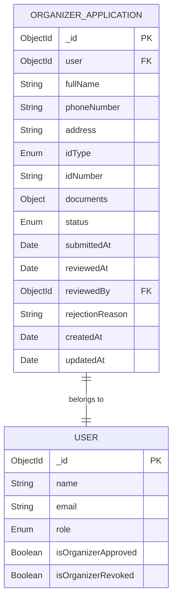

---

## 5. Complete System ERD

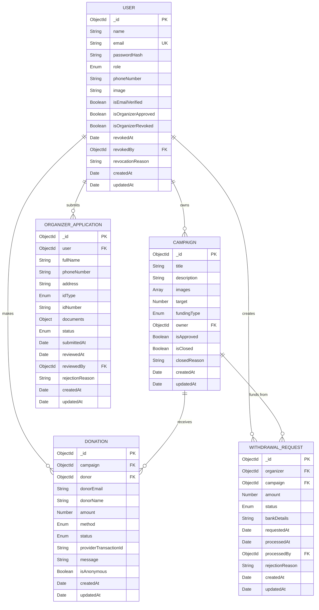

---

## How to Use These Diagrams

1. **GitHub/GitLab**: Copy the code blocks and paste them in your markdown files. They will render automatically.

2. **Mermaid Live Editor**: 
   - Go to https://mermaid.live/
   - Paste the code
   - Export as PNG/SVG for your report

3. **VS Code**:
   - Install "Markdown Preview Mermaid Support" extension
   - Create a .md file and paste the code
   - Preview the markdown file

4. **Documentation Tools**:
   - Most modern documentation tools (Notion, Confluence, etc.) support Mermaid
   - Simply paste the code in a Mermaid code block

5. **For Your FYP Report**:
   - Export diagrams as high-resolution PNG or SVG
   - Insert them into your Word/PDF document
   - Ensure they are readable when printed

## Tips for Better Diagrams

- Adjust node spacing by modifying the graph direction (TB, LR, RL, BT)
- Use subgraphs to group related components
- Add colors using `style` commands if needed
- Keep diagrams focused on one aspect at a time
- Use consistent naming conventions across all diagrams
